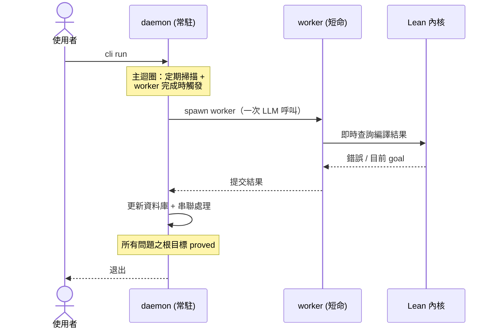
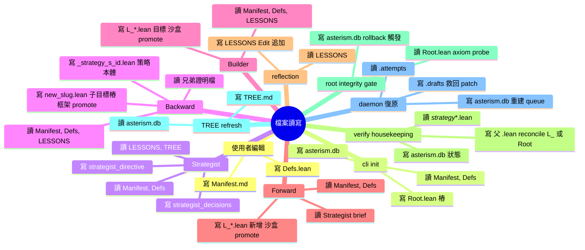
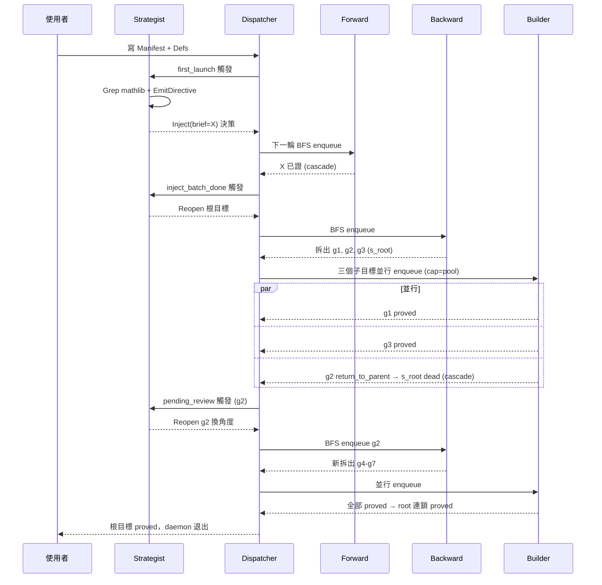
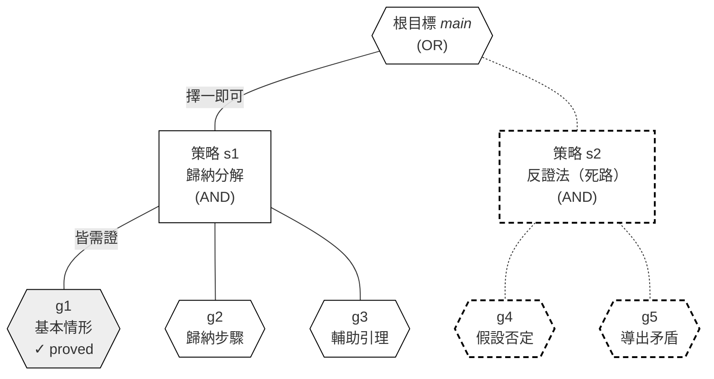
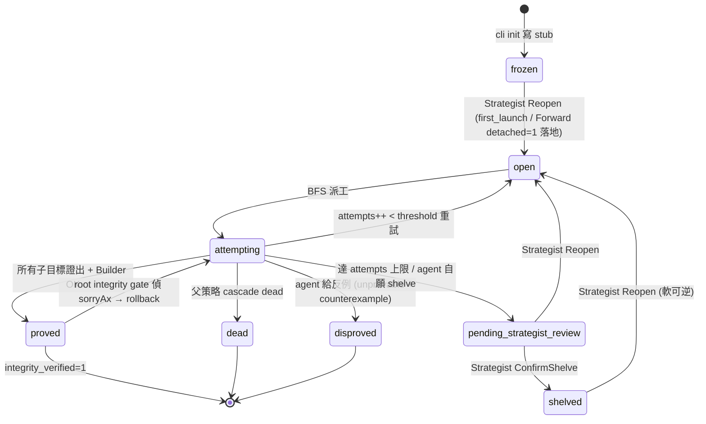
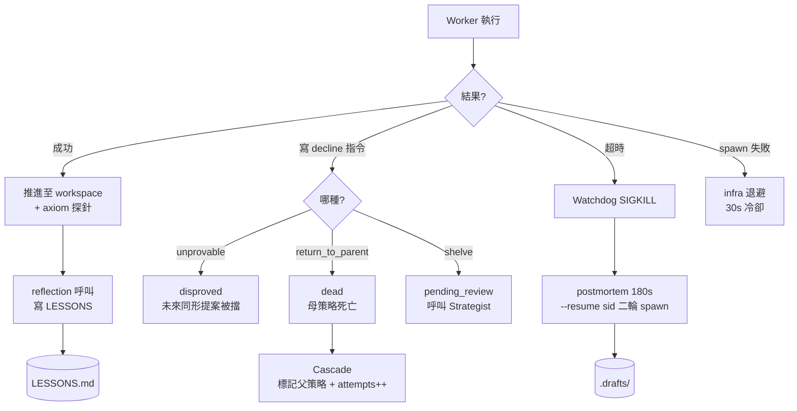

# Asterism 系統介紹：自動化定理證明的多代理協作

本文件介紹 Asterism 框架的整體架構與運作流程。讀者預設熟悉數學與 Lean 4、但無工程背景。文中依主題搭配示意圖、表格或純文字說明。

「代理」（agent）指一次大型語言模型的呼叫。「框架」指環繞代理運作的調度、驗證、狀態管理基礎設施。

## 1. 動機

直接請大型語言模型對一條 Lean 4 定理產出完整證明，往往失敗。三類常見失敗：**幻覺**（援引不存在的引理）、**無回饋**（寫完後不知自己錯）、**多步推理崩潰**（單次呼叫的注意力無法處理數十步分解與串接）。

Asterism 設計即針對此三點：

- **以 Lean 4 內核為事實依據** — 任何證明步驟皆需通過型別檢查，杜絕幻覺。
- **透過 LSP 即時回饋** — 代理寫一步即見編譯結果，無需等冷啟 lake build。
- **將大目標分派多個小代理** — 每個代理只處理單一職責，避開單次呼叫的多步推理瓶頸。

## 2. 系統總覽：daemon 與 worker

Asterism 在一次完整執行中由兩種角色構成：常駐 daemon 主導調度，按需 spawn 多個短命 worker 進行 LLM 呼叫。下圖顯示典型生命週期：

- **daemon**：常駐 Python 進程、負責調度迴圈。每次掃描判定「下一步該派哪個 worker」、收到 worker 結果後更新資料庫並決定串聯效應（例如某個子目標證出後是否解鎖父目標）。
- **worker**：每個 worker 即一次 LLM 呼叫的容器、做完即退出。沙盒目錄為 `.attempts/<uuid>/`；預設工作池容量為 4、即同一時間最多 4 個 worker 並行。
- **Lean 內核**：daemon 在背景駐留一個 Lean 伺服器、提供 worker 寫每一步證明時的即時編譯回饋（無需冷啟 `lake build` 的 30–60 秒成本）。

整個生命週期由 daemon 主導；worker 僅回傳結果即退出，直至所有納入該次執行的問題之根目標皆達 `proved`，daemon 才終止。

## 3. 檔案的所有權與讀寫權限

下圖以每個 pipeline 為節點、放射狀展開其讀寫的檔案：

兩條原則：

- **人類擁有的檔案**（`Manifest.md`、`Defs.lean`）：任何 pipeline 只讀不寫。代理欲修正必走 `RequestUserAmend` 並暫停該問題、等待人工確認。
- **框架擁有的檔案**（`proofs/*.lean`、`TREE.md`、`LESSONS.md`、`asterism.db`、`.attempts/`、`.drafts/`）：使用者勿手動編輯，手動更動將使資料庫與檔案系統失同步。

## 4. 四個代理

Asterism 將證明工作分派給四個專責代理。各代理對應一次大型語言模型呼叫，輸入輸出與時間預算各異：

| 代理 | 輸入 | 輸出 |
| --- | --- | --- |
| **Strategist** | 全域進度視圖、最近決策歷史、TREE 快照、注入批次結果、`pending_strategist_review` 待裁決清單、Manifest meta | 一筆或多筆決策（注入、放行、確認擱置等可組成 batch） |
| **Backward** | 一個待拆目標 + 父策略提示 | 0 至 N 個子目標 + 結構性組合命令（0 個=葉節點直接證） |
| **Builder** | 一個原子目標 | 完整證明（可通過型別檢查與 axiom 探針） |
| **Forward** | Strategist 給的 brief | 一條新的 theorem / def / structure / class 檔案 |

四者形成分層分工：Strategist 規劃調度、Backward 結構分解、Builder 完成原子證明、Forward 補前置引理。

## 5. 端到端流程

以下時序圖為一條典型問題從提交到證完的完整過程：

每個步驟皆由框架自動觸發、無需人工介入。**Strategist 只寫決策（Inject / Reopen / ConfirmShelve 等），不直接派工**；Dispatcher 是唯一的「行動者」，在下一輪 BFS 中根據 Strategist 寫入的決策與當前 goal 狀態 enqueue worker。失敗（如 g2 的 `return_to_parent` 宣告）為一等公民、由 Strategist 介入後重新規劃。

## 6. AND/OR 圖：證明搜索的資料結構

證明搜索的中心資料結構為 AND/OR 圖。OR 節點為目標、AND 節點為策略：

- 六邊形節點為**目標**（OR）；任一掛在其下的策略證出即視為證明。
- 矩形節點為**策略**（AND）；所有掛在其下的子目標皆需證出，策略才算成功。
- 實線框 + 細邊：活路徑。粗虛線框：已死路徑（圖中策略 s2 與其子目標 g4、g5）。淺灰底：已證子目標（圖中 g1）。
- 同一目標下多個策略**序列嘗試**而非並行（passive OR、cap=1）：當前活策略死透後（如圖中 s2），框架才允許 Backward 為該目標生第二條策略；早期 eager fanout 設計在強模型下實證為純粹浪費 token。
- 同一策略下的兄弟子目標可並行（受 `dispatch.pool` 上限約束，預設 4）。
- 框架以廣度優先搜尋掃描所有「存活鏈通達根」的 `open` 目標，按優先級派工；死路徑不影響其他路徑繼續推進。

## 7. 目標狀態機

每個目標在資料庫中有一個狀態欄位，所有狀態轉移由框架統一管理：

關鍵設計：

- `shelved` 與 `dead` 區分軟硬終結。`shelved` 仍可被 Strategist 透過 Reopen 復活（例如後續注入的引理改變了可證性）。`dead` 為母策略整個被否決所致，本目標於該策略內不再嘗試。
- `pending_strategist_review` 為過渡狀態，代理主動聲明無解後置入，等候 Strategist 裁決；本身不終結，故串聯不向上傳播。
- `proved` **非絕對終態**：root integrity gate 在每次 root 完工時對 Root.lean 做 axiom probe，若偵測到 `sorryAx` 殘留即走 `bisect_sorryax_source` + `rollback_cascade_chain`，元凶策略撤回、下游 goal 回 `attempting`。實證自 verify-collapse 以來 41+ 輪 0 次觸發，gate 設計用於極端 corner case 而非常規路徑。

## 8. 失敗處理流程

四類失敗對應不同處理路徑。所有處理由框架統一執行、代理無自主決定權。

- **decline 指令**：代理在沙盒中探索後判定無解、主動聲明，附理由與修正建議。
- **超時**：watchdog 偵測長時間無工具呼叫即 SIGKILL；接著 pipeline 自動以 `claude --resume <sid>` 從磁碟救回該 session、再 spawn 一輪短呼叫（180s 上限）請代理寫進度筆記。此筆記隨後注入新代理的 Context，使重派時不致從零開始。
- **spawn 失敗**：外部基礎設施問題（如配額耗盡），不計入嘗試次數。
- **成功**：reflection 短呼叫請代理回看本次經驗、寫入跨 spawn 累積的 `LESSONS.md`。

## 9. Strategist 的四種觸發條件

Strategist 不主動工作，必待事件觸發。當前定義四種觸發類型，每種對應一份獨立的指引提示：

| 觸發 | 何時觸發 | 主要任務 |
| --- | --- | --- |
| `first_launch` | 問題首次啟動（root 仍 `frozen` 且尚無任何 Strategist 決策） | 調研 mathlib、發布指導、派出前置 |
| `routine` | 每小時定期 | 稽核分支、識別停滯、發現重造輪子 |
| `pending_review` | 子目標出現「待審」 | 裁決失敗：重派、改方向、確認放棄 |
| `inject_batch_done` | 注入批次全部終結 | 評估結果、決定後續（多半 Reopen 被擱置目標） |

每個觸發對應一份獨立 prompt。代理被呼叫時只見該觸發的指引、不受其他模式干擾、注意力集中。觸發優先級由上而下：`inject_batch_done` 最高、`routine` 最低。

`routine` 為唯一無事件驅動的觸發、其職責為防止系統長時間停滯而無人察覺；當前 prompt 明確要求代理執行品質稽核清單、而非預設回應「無事可做」。

## 10. 工具與資料管道

每個代理被呼叫時，框架提供一組工具與分層資料來源。

**工具**

- 檔案操作：`Read` / `Write` / `Edit` / `Grep`，標準命令列語意。
- 與 Lean 伺服器交互：`apply_edit` / `goal_at` / `errors_at` / `validate_file`，皆於 1 秒內回應，避免冷啟 `lake build` 的 30–60 秒成本。
- Mathlib 搜尋：`Grep` 適用於關鍵字、`loogle` 適用於以陳述形狀搜尋。

**資料來源（三層）**

第一層為**任務簡報** `Context.md`：每次呼叫前框架即時編譯一份、即用即棄。內容因代理種類而異——Strategist 看全域進度視圖與最近決策歷史；Backward 與 Builder 看當前目標陳述、父策略提示、可引用的兄弟證明；Forward 看 Strategist 指定的注入 brief。

第二層為**跨 spawn 累積的經驗** `LESSONS.md`：由 reflection 階段在 worker 成功收場時寫入，典型內容如「mathlib 已有 X 引理、不必重造」「Y 路線是死路」「Z 型別陷阱」等戰術提示。每個代理冷啟時皆會於 Context 中看到當前內容。

第三層為**問題級常駐指引** Strategist directive：Strategist 透過 `EmitDirective` 寫入，作為該問題下所有後續代理的長期方向。每次更新覆寫前次內容；每個 worker 冷啟皆會看到最新版本。

資料的流動方向呈一鏈狀：使用者寫 Manifest → Strategist 讀取後寫 directive 與 LESSONS 一同進到 worker → worker 工作完畢由 reflection 寫回 LESSONS → 下一次代理冷啟時讀到。此鏈使知識跨多次嘗試累積、不致每次冷啟皆從零開始。

## 11. 現況與成果

**已自動證出問題涵蓋**：

| 領域 | 代表問題 |
| --- | --- |
| 數論 | Wilson 定理、Pythagorean 三元組、若干 Minif2f 競賽題 |
| 拓樸 | π₁(S¹) 基本群、Sylvester–Gallai 共線定理 |
| 線性代數 | Schur 三角化、SVD、極分解、QR 分解 |
| 分析 | 留數定理 |

**典型成本**：每個問題從提交到證完，平均耗時 2–8 小時、佔 LLM 呼叫 50–300 次。問題的內在複雜度（分解深度、引用 mathlib 引理數量、是否需要新工具）決定實際成本。

**框架自身**：累計 1141 項自動測試、涵蓋狀態機轉換、串聯規則、注入決策、復原邏輯等核心不變式。每次程式碼變更皆需通過全部測試。

**近期觀察到的失敗模式**：

- **重造輪子**：深度極大的子目標常為 Backward 拆題時未識別到 mathlib 已有對應引理。已新增 Citation pass 流程。
- **觸發保護過嚴**：早期 Strategist 觸發互不覆蓋導致停滯。已加結構性停滯偵測。
- **代理注意力被稀釋**：LESSONS 累積過多時代理略讀。下一步規劃關鍵字標籤化。

## 12. 設計取捨

| 取捨 | 我們的選擇 | 代價 |
| --- | --- | --- |
| 驗證方式 | Lean 4 內核（唯一事實源） | 速度較慢、受限 mathlib 覆蓋範圍 |
| 狀態源 | SQLite 資料庫（檔案系統為衍生物） | 手動編輯狀態檔風險極高 |
| 代理結構 | 多代理分工（4 種角色） | 上下文連續性犧牲、換取注意力聚焦 |
| 失敗處理 | 代理可自主 decline + Strategist 接手 | 仰賴 Strategist 判斷品質 |
| 反思機制 | reflection 後寫 LESSONS、跨 spawn 累積 | LESSONS 過長時略讀風險 |

**取捨核心**：選擇 Lean 4 作為唯一事實依據，意味系統無需另設「評審代理」（如其他類似系統採用）——Lean 內核即評審。代價為代理寫的每一步皆需通過嚴格型別檢查、產出較慢。

**未解問題**：

- **跨問題重用**：「Library」子模組尚未啟用，不同問題間無法共享已證引理。
- **長尾子目標**：少數深度極大的子目標耗時遠超預期。
- **經驗傳遞對齊**：LESSONS 與 directive 的代理利用率仍待提升。

下一階段規劃將成熟的引理自動晉升為 Library 條目，並引入關鍵字標籤化機制集中代理注意力於最相關的歷史經驗。
