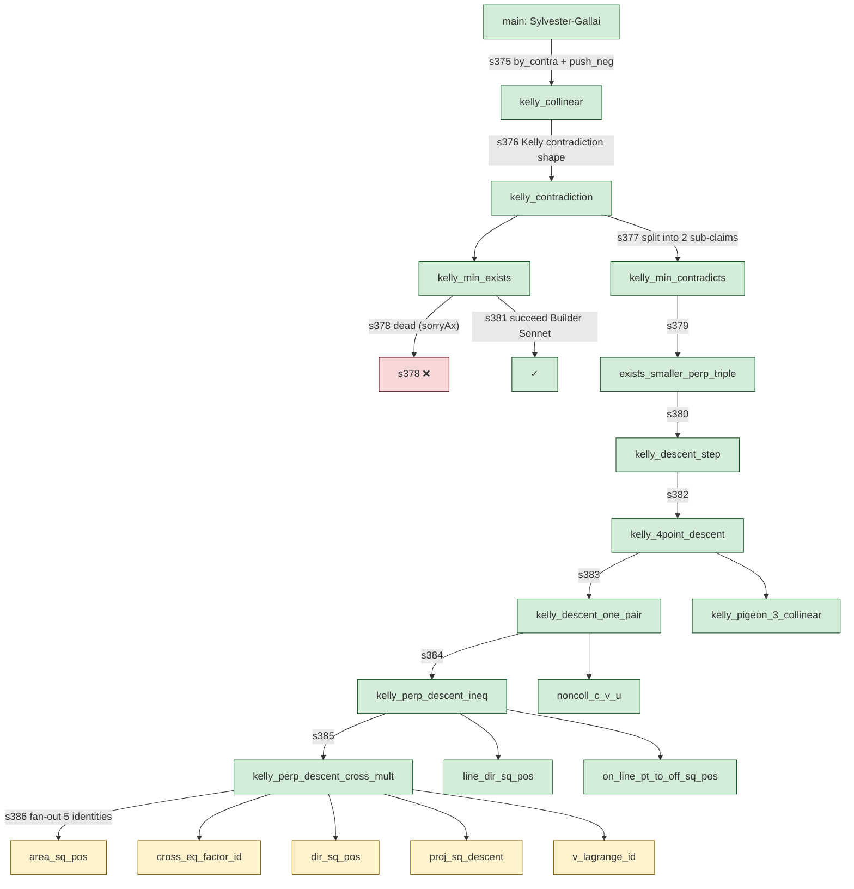

# Sylvester-Gallai cascade — visualization

End-to-end proof of the Sylvester-Gallai theorem, generated by Asterism
on 2026-05-11 in 93 minutes wall-clock. 20 goals, max depth 10, 0
sorryAx leaks (axiom-checked), `lake build` clean across 8399/8399 jobs.

## Theorem

> For any finite set P of points in the plane that is not entirely
> collinear, there exist two points p, q ∈ P such that the line through
> p and q contains no other point of P (an "ordinary line").

Erdős conjecture (1943), proved by Kelly via distance-minimization
argument. Recovered here by Asterism's Opus Backward agent autonomously
choosing this proof strategy — Mathlib has no SG and the framework was
not pre-prompted with Kelly's argument.

## Cascade structure

Legend:
- Green: cascade-promoted goal (via `def slug := @s<id>` alias to scratch)
- Yellow: leaf proof written directly by Builder Sonnet (in-place)
- Red: dead strategy — Builder Sonnet's first attempt at
  `kelly_minimizer_exists` (s378) used `sorryAx` silently; framework's
  acceptance gate caught it, marked dead, framework re-Backward'd
  → s381 succeeded

## Statistics

| Metric | Value |
|---|---|
| Total goals | 20 |
| Goals proved | 20 |
| Max depth | 10 |
| Dead strategies | 1 (s378 sorryAx, replaced by s381) |
| Shelved goals | 0 |
| Wall time | 93 minutes |
| LLM cost | ~$10-20 (Opus Backward × ~12 dispatches, Sonnet Builder × ~15 dispatches) |
| Lake build | 8399 jobs / 8399 green |
| Independent verification | `#print axioms main` → `propext, Quot.sound, Classical.choice` (no sorryAx, no domain axioms) |

## What's notable

**Opus chose Kelly's strategy autonomously**. The framework gave no hint
about distance minimization, perpendicular feet, or the pigeonhole.
Looking at s377's proposal_md:
> `kelly_contradiction: assume the minimum perpendicular distance d > 0
> and produce a contradictory smaller distance via the closer collinear
> hit. Decompose into (i) such a minimum exists, (ii) it leads to a
> smaller witness.`

This IS Kelly's argument. Opus knew it (training data) AND chose to
apply it AND structured the cascade to expose the sub-problems Sonnet
could close (algebraic identities at depth 10).

**Depth 10 cascade closes end-to-end**. miniF2F problems average depth
≤ 3. SG depth-10 is structurally a different regime — closer to real
research math.

**Failure path engineered**. s378 sorryAx detection is the system
*working as designed* — the axiom probe at Backward acceptance caught
agent shortcutting before it polluted the cascade. Compare: systems
that only `lake build` the final proof can ship sorry-tainted theorems
silently.
